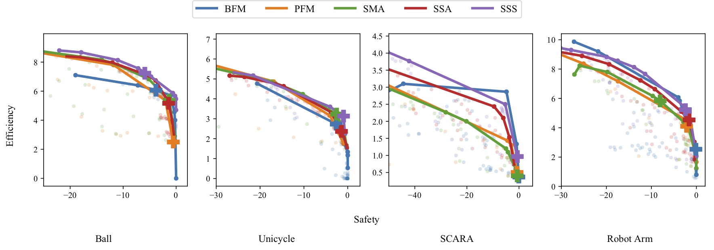
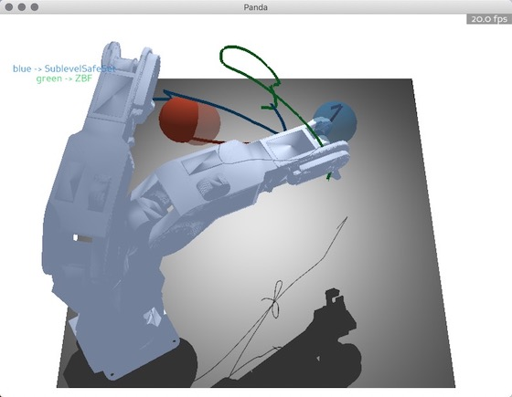

# BIS
|`Document`  |`Version`  |`Tutorial`|
| :---:      | :---:     | :---:    |
| [](https://wei-tianhao.github.io/BIS/build/html/index.html)
| []()
| [] |
### Introduction

BIS is an open source benchmark for safe control algorithms. 

You can evaluate your algorithm on various robot models, including ball model, unicycle model, robot arm model, etc. 

We also provide comparison with different algorithms. Currently implemented algorithms including Potential Field method, Safe Set algorithm, Sliding Model algorithm, Barrier Function algorithm, and Sublevel Safe Set algorithm. 

Various metrics are provided. Numerical analysis like Safety-Efficiency trade-off curves and Speed profile.



We also provide visual comparison tools.



*We used a fancy model to draw paper graphs. But due to the complex appearance and large volume of the fancy model, it may cause precession problem in the actual test. So, by default, we only use simple models like cube and ball to describe the robot.

### Document

Detailed documents of the code can be found at <https://wei-tianhao.github.io/BIS/>.

### Install

To install this repository:

```bash
cd YOURPATH
git clone git@github.com:intelligent-control-lab/BIS.git
#create a virtual environment named psb_env, using the latest python3.6
conda create -n BIS python=3.6
#activate the virtual env
source activate BIS
#install requirement packages
pip install -r requirements.txt
#The next step is only required for MacOS:
#to use matplotlib.pyplot in a conda virtual environment, we need to install python as a framework
conda install python.app
```
### Tutorial

To add new algorithm and new model, please refer to [tutorial.ipynb](https://github.com/intelligent-control-lab/BIS/blob/master/tutorial.ipynb)

To get the results on our paper, please run

```bash
python leaderboard.py
```

To see a demo, please run
```bash
python test.py
```
### Citation

Please cite these papers in your publications if it helps your research:

    @article{wei2019safe,
      title={Safe Control Algorithms Using Energy Functions: A Unified Framework, Benchmark, and New Directions},
      author={Wei, Tianhao and Liu, Changliu},
      journal={arXiv preprint arXiv:1908.01883},
      year={2019}
    }

    @inproceedings{liu2014control,
      Author = {Liu, Changliu and Tomizuka, Masayoshi},
      Booktitle = {Proceedings of the ASME Dynamic Systems and Control Conference (DSCC)},
      Pages = {V003T42A003},
      Title = {Control in a safe set: Addressing safety in human robot interactions},
      Year = {2014},
      Publisher = {ASME}}

Links to these papers:

- [Safe Control Algorithms Using Energy Functions: A Unified Framework, Benchmark, and New Directions](https://arxiv.org/abs/1908.01883?context=cs.SY)
- [Control in a safe set: addressing safety in human-robot interactions](https://pdfs.semanticscholar.org/0ec9/ceef9ed2926c0388636368454cd259ad23fe.pdf)
